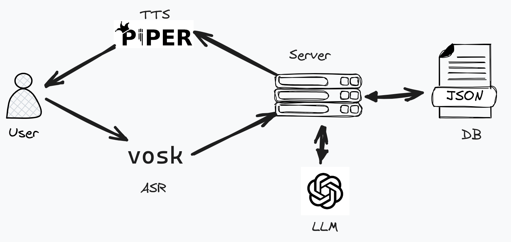

# Banking Chatbot

## Problem Statement

Many people in rural India face challenges navigating banking systems
due to complexity and unfamiliarity. To bridge this gap, we\'re
developing a conversational chatbot offering a user-friendly experience.

Key features include:

- Relaxed, casual interaction: Feel free to chat and ask questions naturally.
- Easy account access: Check your balance, dues, and more with simple commands.
- Effortless money transfers: Send and receive funds conveniently through conversation.

Focusing on natural dialogue, the chatbot caters to straightforward use
cases such as:

1.  Chitchat
2.  Get account details (Balance, Dues, etc)
3.  Transfer money

Optional Features:

1. Speaker Identification

## Use-Cases

### Chitchat

1.  Greet the user
2.  Get the user name
3.  Ge the authorization code (unique code)

#### API Example

```txt
/get_user
{
    "name": str| None,
    "acc_no" : int[3]
}

Response
{
    "auth_code": int,
}
```

### Account Details

1.  LLM should provide the intent as GET_BALANCE,GET_DUE
2.  The server should check with the DB and give the required response

#### API Example

```txt
/get_details
{
    "acc_no": int[3],
}

Response
{
    "name": str,
    "acc_no": int\[3\],
    "balance": float
}

```

### Transfer Money

1.  LLM should provide the intent as TRANSFER_MONEY
2.  Get the other user's name
3.  Verify their Full name with Account ID
4.  Get the amount to be transferred
5.  Give the feedback to user after successful completion of transaction

#### API Example

```txt
/user_search
{
    "name": str ,
}

Response
{
    "name": str,
    "acc_no": int[3],
    "balance": float
}

/transfer_money
{
    "acc_no1": int[3],
    "acc_no2": int[3],
    "amount": float
}

Response
{
"success" : 0/1
}
```

## Pipeline

The pipeline is given below, we will be using different independent
tools to create a pipeline, most of the components chosen here are
lightweight, optimized to run on low-power devices/embedded systems.

Speech Recognition:
[_https://github.com/alphacep/vosk-api_](https://github.com/alphacep/vosk-api)
Server: Flask
LLM:
[_https://github.com/ollama/ollama-python_](https://github.com/ollama/ollama-python)
DB: Simple json file/ You can use any DB
Text-to-speech:
[_https://github.com/rhasspy/piper_](https://github.com/rhasspy/piper)


