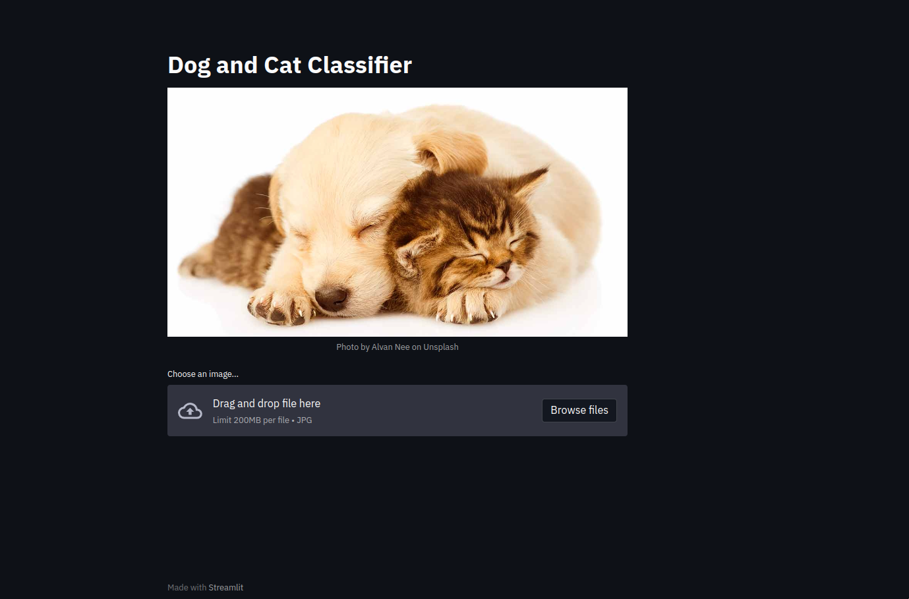

# Cat-Or-Dog-Classifier-Streamlit

> Fork of [Cat-Or-Dog-Recognizer-Web-App-DL-streamlit](https://github.com/surdebmalya/Cat-Or-Dog-Recognizer-Web-App-DL-streamlit/tree/master)

# Introduction

It is a web application where one user can test their images to predict whether
the image is a dog or a cat! The model has the power to predict image of Cats
and Dogs only, so you are requested to give image of a Cat Or a Dog, unless
useless prediction can be done!!!

# Usage

- Install the requirements
  ```sh
  pip install -r requirements.txt
  ```
- Download the training data. Follow instructions in [Readme](./input/Readme.md)
- Train the model.
  ```sh
  python3 src/model.py
  ```
- run the app
  ```sh
  streamlit run src/app.py
  ```
- Enjoy!!
  

# Behind The Scene

Behind the scene there is a CNN model, it's pretty straight forward model, as my aim was to build a full stack, so I was not bother about the accuracy, though the rough model already gives around **65%** accuracy on the test set provided in the dataset. Feel free to improve the model with new ideas.

Checkout model architecture in [model.py](./src/model.py)
